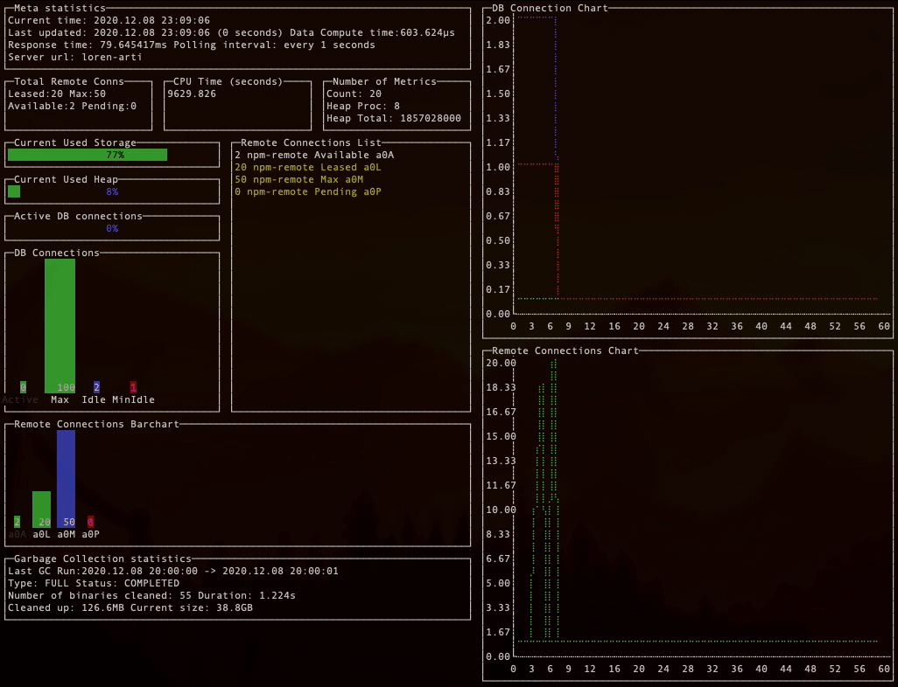

# frogvision

## About this plugin
This plugin uses the open metrics API of Artifactory to visually display information in graphical format.

## Installation with JFrog CLI
### Option 1 - current
Since this plugin is currently not included in [JFrog CLI Plugins Registry](https://github.com/jfrog/jfrog-cli-plugins-reg), it needs to be built and installed manually. Follow these steps to install and use this plugin with JFrog CLI.
1. Make sure JFrog CLI is installed on you machine by running ```jfrog```. If it is not installed, [install](https://jfrog.com/getcli/) it.
2. Create a directory named ```plugins``` under ```~/.jfrog/``` if it does not exist already.
3. Clone this repository.
4. CD into the root directory of the cloned project.
5. Run ```go build``` to create the binary in the current directory.
6. Copy the binary into the ```~/.jfrog/plugins``` directory.

### Option 2 - once the plugin has been accepted
Installing the latest version:

`$ jfrog plugin install frogvision`

Installing a specific version:

`$ jfrog plugin install frogvision@version`

Uninstalling a plugin

`$ jfrog plugin uninstall frogvision`

## Usage
### Commands
* graph
    - Arguments:
        - none
    - Flags:
        - none
    - Example:
    ```
   $ jfrog frogvision graph
    ```
    
    
* metrics
    - Arguments:
        - list - list metrics
    - Flags:
        - raw: Output straight from Artifactory **[Default: false]**
        - min: Get minimum JSON from Artifactory (no whitespace) **[Default: false]**
    - Example:
    ```
  $ jfrog frogvision metrics --raw

  # HELP jfrt_artifacts_gc_current_size_bytes Total space occupied by binaries after Garbage Collection
  # UPDATED jfrt_artifacts_gc_current_size_bytes 1607284811440
  # TYPE jfrt_artifacts_gc_current_size_bytes gauge
  jfrt_artifacts_gc_current_size_bytes{end="1607284801199",start="1607284800142",status="COMPLETED",type="FULL"} 3.823509e+10 1607287853275  
  ```

### Environment variables
None

## Additional info
None.

## Release Notes
The release notes are available [here](RELEASE.md).
